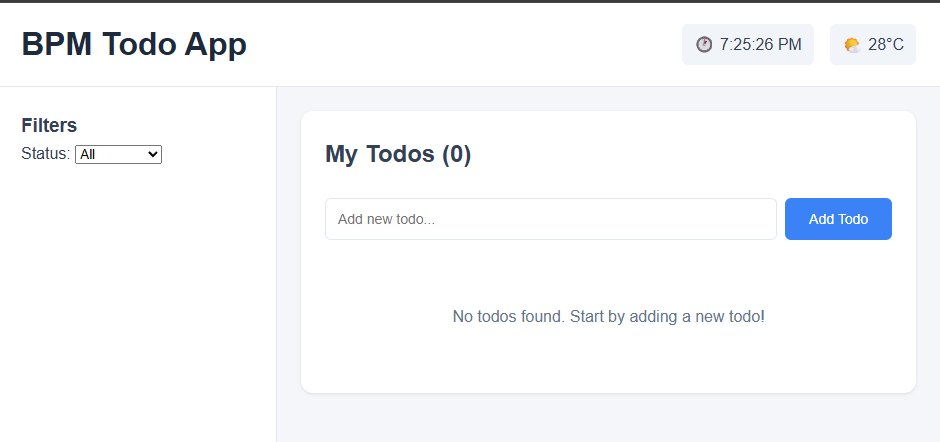

# Todo-list App

## Installation & Setup

1. Install dependencies:
   ```bash
   npm install
   ```
2. Run development server:
   ```bash
   npm run dev
   ```
3. Open browser at `http://localhost:5173` (atau port yang ditampilkan di terminal)

## Screenshot


