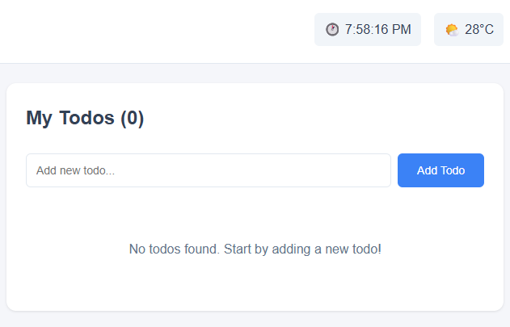

# BPM Todo App

Aplikasi prototype To-Do List sederhana yang dibuat untuk perusahaan BPM (Business Process Engineering).

## Features

- ✅ **CRUD Todo**: Tambah, edit, hapus, dan tandai todo sebagai selesai
- 🏷️ **Kategorisasi**: Sistem kategori untuk mengorganisir tugas (Work, Personal, Shopping, Health)
- 🔍 **Filter & Search**: Filter berdasarkan status, kategori, dan pencarian keyword
- 🌤️ **Weather Widget**: Menampilkan cuaca saat ini menggunakan Open-Meteo API
- 🕐 **Clock Widget**: Menampilkan waktu real-time dengan timezone
- 🎯 **Drag & Drop**: Urutkan todo dengan drag-and-drop (dengan @dnd-kit)
- ⚡ **Loading Animations**: Animasi loading untuk semua operasi
- 📱 **Responsive Design**: Tampilan responsif untuk desktop dan mobile

## Tech Stack

- **Frontend**: React 19+ dengan Vite
- **State Management**: Redux Toolkit + Redux-Saga
- **HTTP Client**: Axios
- **Drag & Drop**: @dnd-kit
- **Styling**: CSS Modules
- **Build Tool**: Vite

## Installation & Setup

1. Install dependencies:
   ```bash
   npm install
   ```
2. Run development server:
   ```bash
   npm run dev
   ```
3. Open browser at `http://localhost:5173` (atau port yang ditampilkan di terminal)

## Screenshot



---

**Developed by Frontend Engineer - BPM (Business Process Engineering)**
